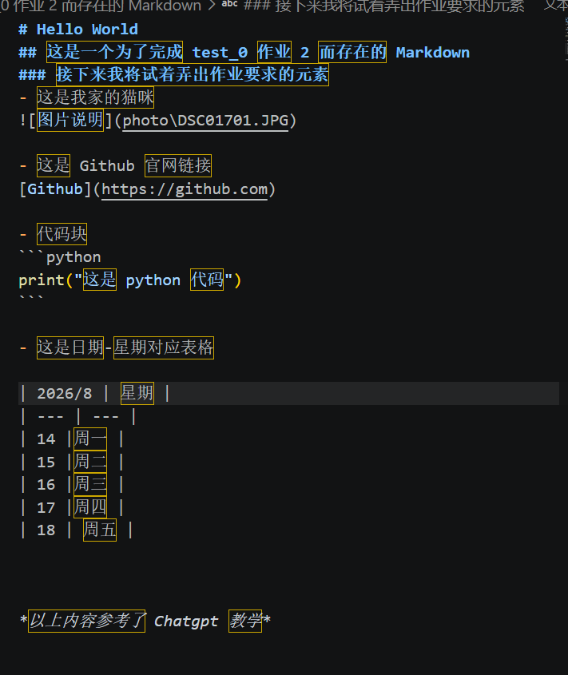
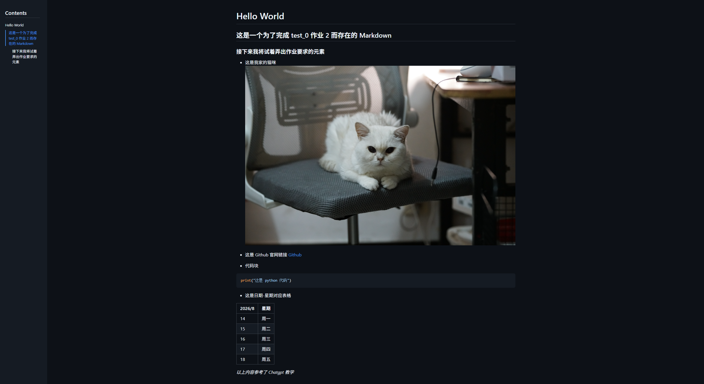
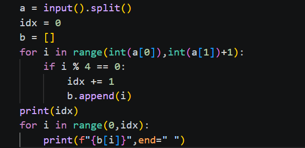
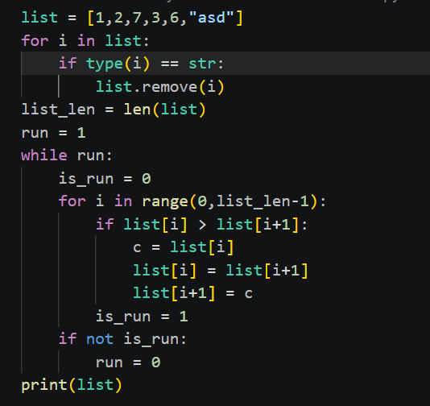

# task-0 的学习记录
## 9 月 17 日
我学习了 git 和 github 的基本用法，也就是学到 git 命令初上手。

**作业 1**
- 我下载了 python3.14.7 ，并下入C盘（似乎改不了路径？？）;接着根据 vscode 提示，我安装了 python 扩展插件；最终测试。成功打印 “Hello World”。
- 至于浏览器，我使用的 edge，文件管理，截图，自由访问网站等我应该也ok。
**作业 2**
- 我创建了一个 github 仓库，并命名为 learn-ai-hyzzz145。接着我在E盘 project 文件夹创建了 test_markdown 文件夹进行 Markdown 文档的撰写。

- 这是我的 Markdown

*好像图片有点太大了*
- 接着我在 vscode 的终端把我这个crazy-day.md 上传至 github learn-ai-hyzzz145 仓库上。
- 我记录一下，我在上传 github 时遇到的几个坑 
    - 上传 learn-ai-hyzzz145 时，报错，查询后发现我在之前把一个 README.md 上传到了这个仓库，Git 为防止覆盖远程内容，拒绝了推送。
    - 在上传后，发现图片无法显示，而自己预览时可以显示，问了 chatgpt 后，说是因为在路径里，要打成 photo/xxx.JPG 才可以在 github 上显示，而我使用了 “\” ,即 photo\xxx.JPG。
-那么作业 2 算是完成了吧
**作业 3**
- 作业 3 just so so.
**作业 4**
- 哎，python 都忘光了，上次玩 python 还是在高二。先看一些小视频复习一下。
- 30 min 速通了一遍 python 基础。感觉相比于 c 语言多了很多函数，虽然看起来更简洁。

## 9 月 18 日
**作业 4**
- 4.1
    - 说实话，第一题把我难住了，我一开始思路是创造两个变量 input ，结果发现无法实现空格效果。最后发现原来可以用 split 函数。
- 4.2
    - 有了上一题的经验，这题轻松解决。
- 4.3
    - 我感觉我这程序没问题啊，但过不了检测
    

    - 我气笑了，问了千问大模型才发现我对闰年的定义有误，闰年无法被 100 整除，但可以被 400 整除。
- 4.4
    - 代码写完似乎无法提交浴谷检测，但尝试了几个数，程序可以正常运行。
- 4.5
    - 神秘原创题。
    - OK ,完成。
**Bonus**
- 比较基础的 Python 程序
    - 1
        - 暴力硬算
    - 2
        - 第二题也 just so so
    - 3
        - 第三题一开始忘记函数了，问了下千问。
    - 4
        - 写完后，电脑风扇飞快转动，程序似乎死机了
        
        - 定睛一看，原来是 is_run 变量写在了 if 的外面，好在修改后程序可以正常运行

