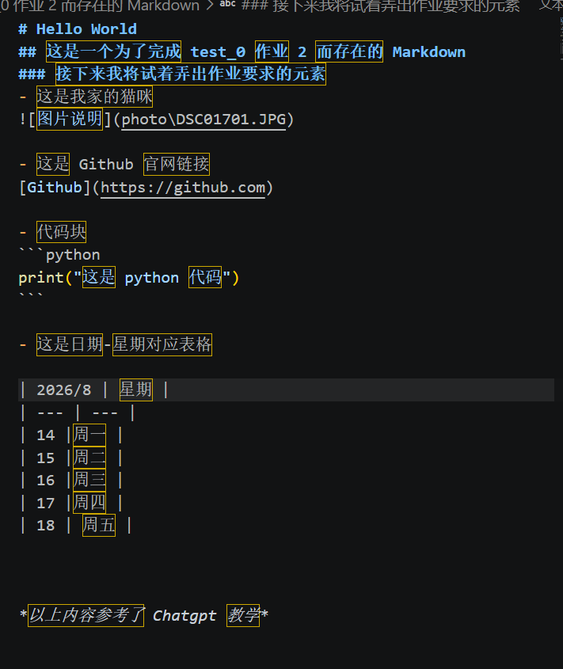
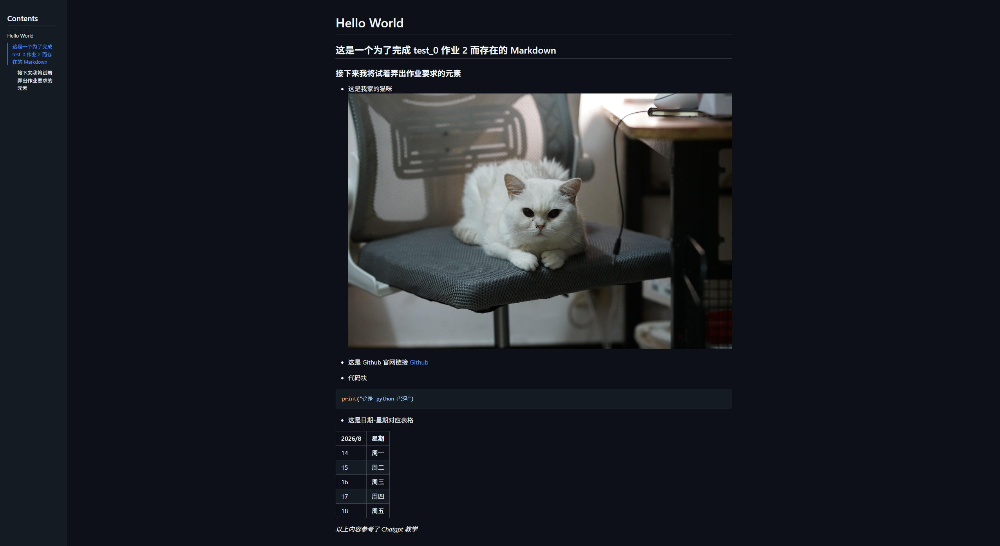
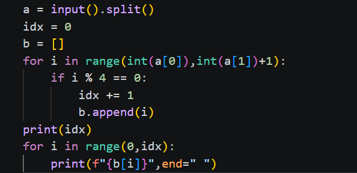
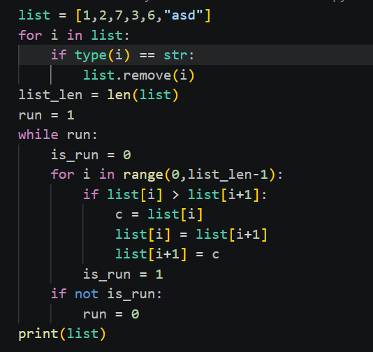
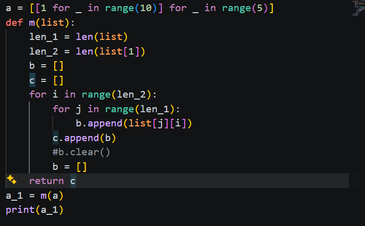
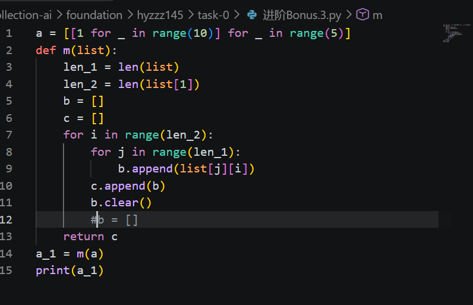

# task-0 的学习记录

## 9 月 17 日

我学习了 git 和 GitHub 的基本用法，也就是学到 git 命令初上手。

### 作业 1

- 我下载了 Python 3.14.7 并安装到 C 盘（似乎改不了路径？？）。
  接着根据 VS Code 提示安装 Python 扩展插件，最终成功打印“Hello World”。
- 至于浏览器，我使用的 edge，文件管理，截图，自由访问网站等我应该也ok。

### 作业 2

- 我创建了一个 GitHub 仓库，命名为 learn-ai-hyzzz145。接着我在 E 盘
  project 文件夹创建了 test_markdown 文件夹，撰写 Markdown 文档。

- 这是我的 Markdown

图片好像有点太大了。

- 接着我在 vscode 的终端把我这个crazy-day.md 上传至 github learn-ai-hyzzz145 仓库上。
- 我记录一下，我在上传 github 时遇到的几个坑
  - 上传 learn-ai-hyzzz145 时，报错，查询后发现我在之前把一个 README.md 上传到了这个仓库，Git 为防止覆盖远程内容，拒绝了推送。
  - 上传后发现图片无法显示，但本地预览正常。询问 ChatGPT 后得知，
    GitHub 图片路径应写成 `photo/xxx.JPG`。我当时使用反斜杠，即
    `photo\xxx.JPG`。
- 那么作业 2 算是完成了吧

### 作业 3

- 作业 3 just so so.

### 作业 4

- 哎，python 都忘光了，上次玩 python 还是在高二。先看一些小视频复习一下。
- 30 min 速通了一遍 python 基础。感觉相比于 c 语言多了很多函数，虽然看起来更简洁。

## 9 月 18 日

### 作业 4：题目记录

- 4.1
  - 说实话，第一题把我难住了，我一开始思路是创造两个变量 input ，结果发现无法实现空格效果。最后发现原来可以用 split 函数。
- 4.2
  - 有了上一题的经验，这题轻松解决。
- 4.3
  - 我感觉我这程序没问题啊，但过不了检测
    

  - 我气笑了，问了千问大模型才发现我对闰年的定义有误，闰年无法被 100 整除，但可以被 400 整除。
- 4.4
  - 代码写完似乎无法提交浴谷检测，但尝试了几个数，程序可以正常运行。
- 4.5
  - 神秘原创题。
  - OK ,完成。

### Bonus

- 比较基础的 Python 程序
  - 1
    - 暴力硬算
  - 2
    - 第二题也 just so so
  - 3
    - 第三题一开始忘记函数了，问了下千问。
  - 4
    - 写完后，电脑风扇飞快转动，程序似乎死机了

        

    - 定睛一看，原来是 is_run 变量写在了 if 的外面，好在修改后程序可以正常运行
  - 5
    - eazy. 学习了 `dict.keys()`、`dict.values()`、`dict.items()`，还有 `del`
      是删除某个键值对，`pop` 用来返回被删除的值，`dict.clear()` 直接重置字典。
  - 6
    - 学习了 dict.update({keys:values}) 的应用、
  - 7
    - 一开始有点没看懂题目,完完全全没头绪啊，啥是私有数据，公有成员？？算了，现在已经半夜 12 点 51 分了，剩下就交给明天吧。

## 9 月 19 日

- 比较基础的 Python 程序
  - 7
    - 过了一遍面向对象基础，看来第七题没那么难。
  - 8
    - 初看题目，这是不是要调用随机库，还要搞到 txt 里，小复杂。以下参考千问 AI 的教学。
    - 了解到 `random` 里的 `shuffle` 函数可以打乱列表
    - 一路曲折，学习了 `join` 函数（用空格连接列表内容并转换成字符串）
      以及 `with open` 的基础知识。使用 `with open` 时，记得设置
      `encoding="utf-8"`，否则可能乱码。

- 相对进阶的 Python 程序
  - 1
    - 嗯，开始看看进阶。
    - 啊，啥是修饰器。
    - 还好吧，了解之后这题不算难
    - 通过此题，学习了 decorate ,同时也了解是 time 库。

  - 2
    - 似曾相识。
    - 正好复习一下。
    - ok，完成，我搞了个排序方法。

  - 3
    - 好吧，第一眼还是没看懂，什么是推导式？？
    - 终于搞好了，我弄懂了一个东西
    - 如下图
        
        
    - 这两段程序的输出不一样：前者正常输出行列转换后的列表，后者输出空列表。
      关键在于后者的 `list.clear()` 清空了原列表，没有改变 `b` 的指针；
      因此执行 `c.append(b)` 时，写入 `c` 的都是同一个地址。
  - 4
    - 开学魔法方法。
    - 学完脑子要炸了，好在了解了 str len eq 等魔法方法。
  - 5
    - 终于到正则表达式了，又是一项记忆大工程
    - 还行，题目能做
